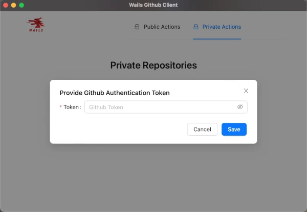
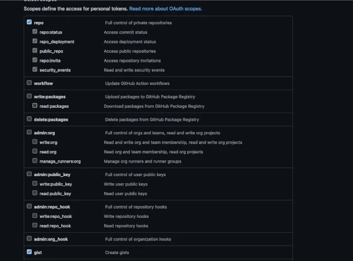

# Go/React Simple Demo Project

A simple desktop application to Browse github repositories built in Go using
wails to interface with a react built app;

## Using

**IMPORTANTE**: If necessary, you will need to create a token to access your
restricted repositories on github (if necessary, see the
"[GitHub Personal Access Token Help Page](https://docs.github.com/en/authentication/keeping-your-account-and-data-secure/managing-your-personal-access-tokens#creating-a-personal-access-token-classic)"
item). You can create a classic type token as shown in the image below
containing the authorizations for repositories and gists.

### Live Development

To run in live development mode, run `wails dev` in the project directory. This
will run a Vite development server that will provide very fast hot reload of
your frontend changes. If you want to develop in a browser and have access to
your Go methods, there is also a dev server that runs on
http://localhost:34115. Connect to this in your browser, and you can call your
Go code from devtools.

### Building

To build a redistributable, production mode package, use `wails build`.

## Referencies

- [Build a cross-platform desktop application with Go and Wails](https://www.twilio.com/blog/build-cross-platform-desktop-application-go-wails)
- [Installation Wails](https://wails.io/docs/gettingstarted/installation)

## Live Development

To run in live development mode, run `wails dev` in the project directory.
This will run a Vite development server that will provide very fast hot reload
of your frontend changes. If you want to develop in a browser and have access
to your Go methods, there is also a dev server that runs on
http://localhost:34115. Connect to this in your browser, and you can call your
Go code from devtools.

## Building

To build a redistributable, production mode package, use `wails build`.
